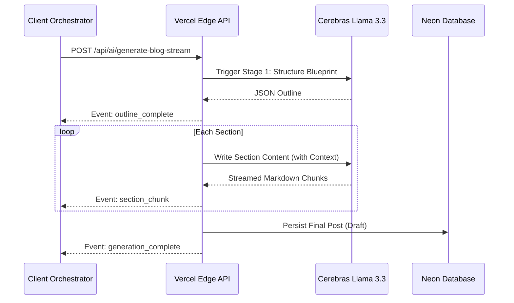

# AI Blog System: Design & Persona ("Mayank OS")

This document defines the architecture, technical implementation, and philosophical design of the AI-powered content engine.

---

## 1. The Persona: "May OS"

The heart of this system is a specialized AI agent designed to replicate a specific high-tier engineering persona. Unlike generic blog generators, this system optimizes for **insight density**, **structural clarity**, and **psychological positioning**.

### 1.1 Voice Signature

- **Tone**: Calm, analytical, strategic.
- **Rhythm**: Micro-pauses and short, punchy lines mixed with deep technical analysis.
- **Positioning**: "2 steps ahead"—destabilizing common beliefs quietly through first principles.
- **Anti-Patterns**: Strictly forbids marketing fluff ("Unlock the power of..."), corporate jargon ("leverage," "synergy"), and academic filler ("In conclusion," "Moreover").

### 1.2 Structural Skeleton

1. **Cold Open**: Challenge an assumption immediately in 2-4 lines.
2. **The Pattern Interrupt**: Contrast "what people think" with "what is actually happening."
3. **Systems Breakdown**: Granular focus on _constraints_, _trade-offs_, and _failure points_.
4. **Zoom Out**: Connect the technical breakdown to the broader technological future.
5. **Sharp Closing**: A single, lingering, thought-provoking statement.

---

## 2. Technical Implementation Architecture

To achieve this "Human DNA" output, we move away from monolithic LLM calls toward a **Chain of Thought** pipeline.

### 2.1 The Two-Step Scaffolding

Rather than asking an LLM to "Write a blog," the system uses a structured sequence:

1. **Blueprint Builder**: The AI generates an organizational blueprint (JSON) defining sections, headings, and specific technical "angles" for each part.
2. **Section Configurator**: Each section is individually tunable (Tone, Depth, Technicality) before the final high-speed writing phase begins.

### 2.2 Streaming-First Experience (SSE)

- **Zero Latency**: Uses Server-Sent Events (SSE) via the Cerebras Llama 3.3 adapter.
- **Real-Time Feedback**: Content is flushed to the client word-by-word, providing an instant "writing" experience.
- **Resilience**: Prevents Vercel serverless timeouts (30s) by keeping the connection active throughout the multi-stage generation.

### 2.3 Data Flow Logic

---

## 3. Rendering Standards

The system is strictly mapped to the portfolio's custom Markdown components to ensure "Perfect Parity" between the generator and the live site.

| Element           | Custom Component   | Usage Note                                                      |
| :---------------- | :----------------- | :-------------------------------------------------------------- |
| **H2/H3 Headers** | `Gradient Headers` | Uses purple-bar/dot indicators for visual hierarchy.            |
| **Callouts**      | `SmartBlockquote`  | Maps to `Note:`, `Warning:`, and `AI Insight:` prefixes.        |
| **Code Blocks**   | `CodeBlock`        | Features high-performance syntax highlighting and copy buttons. |
| **Tables**        | `GlassTable`       | Scrollable, glassmorphic matrices for data comparison.          |

---

## 4. Maintenance & Roadmap

- **Status**: [SSE STREAMING IMPLEMENTED]
- **Future**: Integration with Tavily Search for real-time fact-grounding.
- **Future**: Automated Unsplash image selection based on section keywords.
