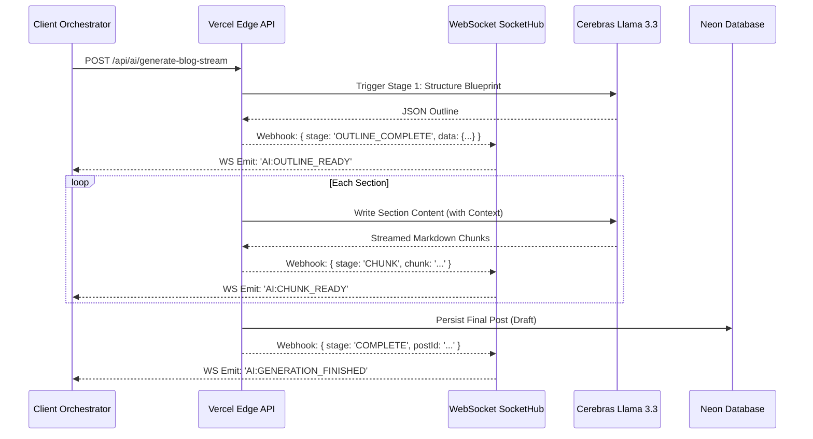

# AI Content Engine: Architecture & Design

This document outlines the technical architecture, implementation, and persona configuration of the AI-powered content generation engine.

---

## 1. Persona Configuration: "May OS"

The system utilizes a specialized agent configured to replicate high-tier engineering personas. It prioritizes information density and structural clarity over generic text generation.

### 1.1 Voice Specification

- **Tone**: Analytical, strategic, and objective.
- **Rhythm**: Varied cadence using technical analysis and concise statements.
- **Perspective**: First-principles approach focused on destabilizing conventional assumptions.
- **Constraints**: Prohibits promotional language, corporate jargon, and academic filler.

### 1.2 Content Structure

1. **Assumption Challenge**: 2-4 line opening challenging a core premise.
2. **Pattern Contrast**: Analysis of perceived reality versus systemic actuality.
3. **Systems Analysis**: Granular focus on technical constraints, trade-offs, and failure points.
4. **Contextual Synthesis**: Integration of technical breakdowns with broader technological trajectories.
5. **Final Directive**: Single concluding statement intended to promote further inquiry.

---

## 2. Technical Architecture

Implementation utilizes a **Chain of Thought** pipeline rather than monolithic LLM calls to ensure deterministic, high-quality output.

### 2.1 Generation Pipeline

The system follows a two-stage sequential process:

1. **Blueprint Generation**: Output of a structural JSON schema defining sections, headings, and technical angles.
2. **Section Synthesis**: Individual tuning of section parameters (Tone, Depth, Technicality) followed by parallelized or sequential writing.

### 2.2 Communication Protocol (SSE & WebSockets)

- **Transmission (Standard)**: Utilizes Server-Sent Events (SSE) via the Cerebras Llama 3.3 adapter for single-tab streaming.
- **Orchestration (Enhanced)**: Moving to **WebSockets (WS)** for decoupled generation. This allows the admin to initiate a job and receive updates via the global `SocketHub` even if the dedicated generation tab is closed.
- **Timeout Management**: Persistent connections (SSE or WS) bypass serverless execution limits (e.g., Vercel's 30s cap).

### 2.3 System Data Flow

---

## 3. Rendering Integration

The engine is mapped to specific portfolio components to maintain visual and functional parity.

| Element      | Component          | Implementation Logic                                          |
| :----------- | :----------------- | :------------------------------------------------------------ |
| **Headers**  | `Gradient Headers` | Hierarchical indicators via visual anchors (bars/dots).       |
| **Callouts** | `SmartBlockquote`  | Semantic prefix mapping (`Note:`, `Warning:`, `AI Insight:`). |
| **Code**     | `CodeBlock`        | Syntax highlighting and clipboard integration.                |
| **Matrices** | `GlassTable`       | Responsive, glassmorphic data visualization.                  |

---

## 4. Maintenance & Roadmap

- **Current Status**: SSE Streaming deployed.
- **Short-term**: Integration with Tavily Search for real-time validation.
- **Medium-term**: Automated asset selection via Unsplash keyword mapping.
