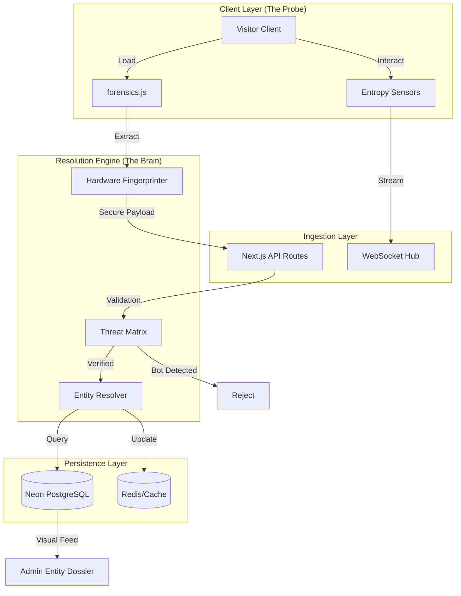
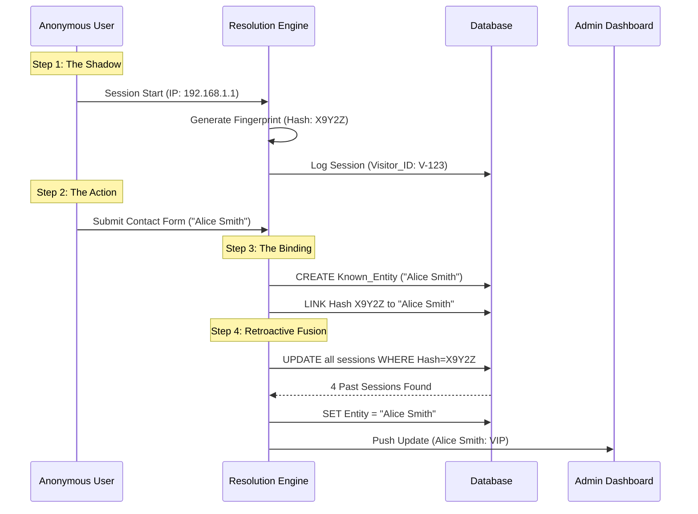
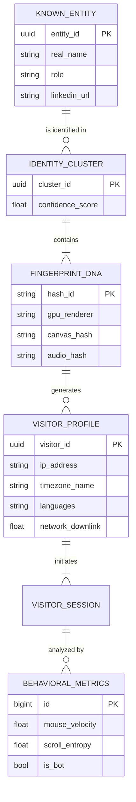

# Analytics Architecture: Forensic Intelligence V2

## 1. System Overview

The **Forensic Intelligence Engine** (System V2) replaces standard session counting with deep-layer identity synthesis. It ingests high-entropy hardware signals to de-anonymize traffic, correlating disparate sessions into unified **Entity Dossiers**.

### Primary Objectives

- **De-anonymization**: Resolve anonymous sessions to real-world identities via forensic triangulation.
- **Bot Elimination**: Filter automated traffic using behavioral entropy and hardware verification.
- **Persistent Tracking**: Maintain strict identity continuity across browser restarts, incognito modes, and IP changes.

---

## 2. Intelligence Architecture

The system operates on a unidirectional data flow from client-side extracting to server-side resolution.

---

## 3. Forensic Data Ingestion

The `forensics.js` module extracts immutable hardware characteristics and network telemetry to generate a unique **Device Hash**.

### 3.1 Hardware DNA Signals

High-entropy signals used for generating the **Euclidean Identity (EU ID)**.

| Signal Class  | Metric                | Entropy      | Technical Purpose                                                                              |
| :------------ | :-------------------- | :----------- | :--------------------------------------------------------------------------------------------- |
| **Graphics**  | `UNMASKED_RENDERER`   | High         | Identifies specific GPU silicon (e.g., "Apple M2 Pro", "NVIDIA RTX 4090").                     |
| **Rendering** | Canvas Hash           | **Critical** | Renders hidden 2D primitives. Differences in anti-aliasing engines create a unique hash.       |
| **Audio**     | Audio Context         | High         | Oscillator tone generation. Floating-point math variations create a unique acoustic signature. |
| **Compute**   | `hardwareConcurrency` | Low          | CPU Core count. Used for broad categorization.                                                 |
| **Memory**    | `deviceMemory`        | Low          | RAM estimate (e.g., 8GB).                                                                      |

### 3.2 Silent Location Intelligence

Non-invasive triangulation of physical location without permission popups.

| Metric       | Source                | Logic                                                                                     |
| :----------- | :-------------------- | :---------------------------------------------------------------------------------------- |
| **Timezone** | `Intl.DateTimeFormat` | System timezone (e.g., `America/New_York`). Cross-referenced with IP for VPN detection.   |
| **Locale**   | `navigator.languages` | Preferred language stack (e.g., `en-US, ja-JP`). Reveals user origin.                     |
| **Platform** | `navigator.platform`  | OS Kernel ID (e.g., `Win32`, `MacIntel`).                                                 |
| **Network**  | `connection.downlink` | Bandwidth estimation. Distinguishes Fiber (High stability) from Cellular (High varience). |

---

## 4. Identity Resolution Logic ("God Mode")

The system uses a **Retroactive Linkage Strategy** to bind anonymous hardware hashes to known identities.

### 4.1 The Resolution Workflow

### 4.2 Entity States

1.  **Shadow (Anonymous)**: Tracked via Hardware Hash. No name.
2.  **Suspect**: High return rate, developer-like behavior, no name.
3.  **Known Entity**: Linked to real-world identity via Contact Form, Email Click, or Login.

---

## 5. Automated Defense Matrix

Traffic is filtered through a hierarchical bot defense system before analytics are recorded.

### 5.1 Defense Layers

1.  **Honeypot (`_hp`)**: Hidden form field. If populated -> **Immediate Rejection**.
2.  **Velocity Check**: Time-to-Interaction analysis. Submissions < 500ms -> **Blocked**.
3.  **Entropy Analysis**:
    - **Bot**: Linear mouse movement, constant scroll speed, instant clicks.
    - **Human**: Curvilinear movement, variable acceleration, micro-jitters.

---

## 6. Data Persistence Schema

The database schema supports the storage of complex entity relationships.

---

## 7. Visualization Interface

The **Admin Dashboard** exposes this data via specific "God Mode" components.

### 7.1 Entity Dossier (`EntityDossier.jsx`)

A forensic detail panel.

- **Location Intelligence**: Displays IP City vs. System Timezone.
- **Hardware DNA**: Raw GPU and Renderer strings.
- **Visual Timeline**: Vertical stream of user interactions (Clicks, Views).

### 7.2 Active Swimlanes (`ActiveSwimlane.jsx`)

Real-time session monitor.

- **Live Progress**: Visual progress bar based on session duration.
- **Status Indicators**: `LIVE` vs `IDLE` based on heartbeat telemetry.
- **Journey Breadcrumbs**: Displays `last_path` and `action_count`.

---

## 8. Implementation Reference

### Key Files

- **Ingestion**: `src/shared/analytics/forensics.js`
- **API Handler**: `server/api/analytics/track.js`
- **Resolution**: `server/api/contact.js`
- **Visualization**: `src/features/admin/components/EntityDossier.jsx`

### Configuration

- **Socket Hub**: `server/socket-hub.js` (Handles real-time telemetry).
- **Rate Limits**: `50 req/min` for tracking endpoints.
