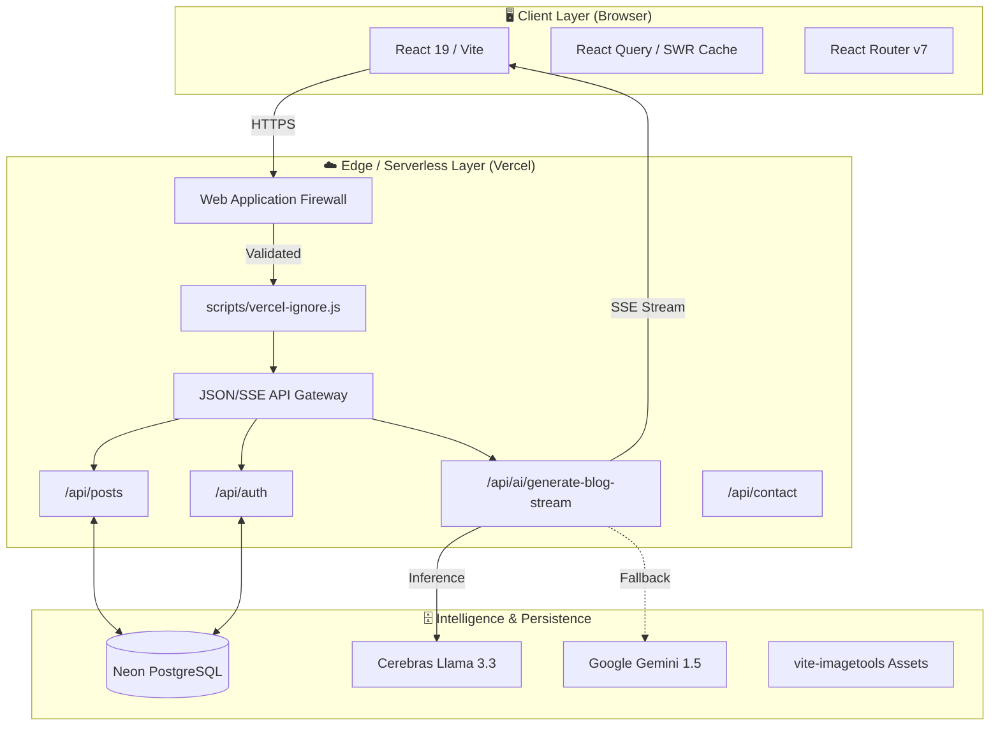
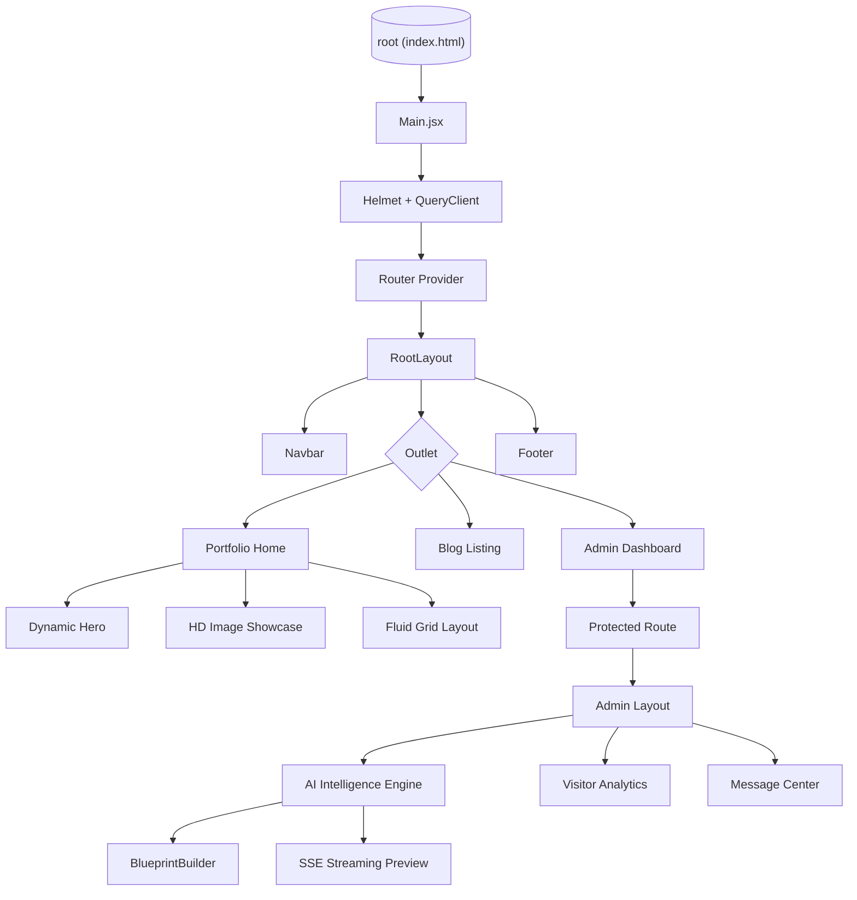
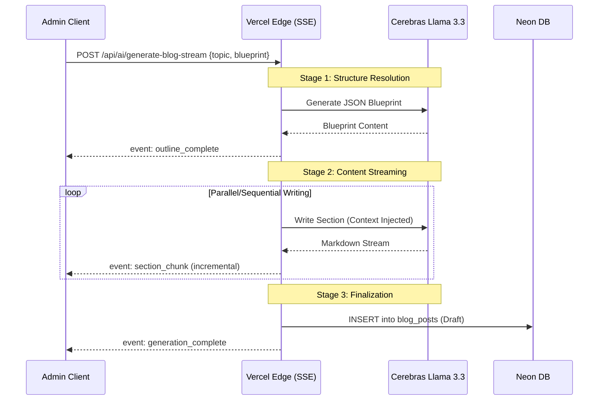

# Portfolio Platform: System Design & Data Foundations

This document details the architectural patterns, component hierarchies, and data orchestration strategies utilized within the Portfolio Platform.

---

## 1. System Architecture Overview

The platform integrates Client (Browser), Edge Network (Vercel), and Persistence/Intelligence services (Cerebras, Neon).



---

## 2. Component Hierarchy

The application follows a domain-driven structure to isolate public portfolio assets from administrative control systems.



---

## 3. Data Flow: AI Generation

The system utilizes a streaming-first architecture to manage long-running inference tasks.

### 3.1 SSE Streaming Pipeline

- **Challenge**: Comprehensive technical content generation often exceeds standard serverless timeout limits (e.g., Vercel's 30-second cap).
- **Solution**: **Server-Sent Events (SSE)**. A persistent connection allows incremental data flushing as the Cerebras engine generates content.



---

## 4. Project Structure

```text
my-portfolio-steeltroops/
├── api/                            # Vercel Serverless (JSON/SSE)
├── docs/                           # Knowledge Repository
│   ├── database/                   # SQL & Schema definitions
│   ├── archive/                    # Historical logs
│   └── *.md                        # Architectural Blueprints
├── scripts/                        # CI/CD & DevOps Automation
├── src/                            # React Application Core
│   ├── features/                   # Domain Modules (Admin, Blog, Portfolio)
│   ├── shared/                     # Shared UI/Logic (Components, Hooks, Lib)
│   └── constants/                  # Configuration & Tokens
└── public/                         # PWA Assets & SEO Metadata
```

---

## 5. Persistence Strategy

The database is configured for transactional integrity and optimized full-text search.

### 5.1 Schema Definitions

- **POSTS**: Features `tsvector` columns for high-speed GIN-indexed searching. Includes `generation_status` for tracking AI progress.
- **CONTACT_MESSAGES**: Relational threads for admin-to-user communication.
- **ANALYTICS**: Aggregated visitor data (Device, Duration, Entry Path).

---

## 6. Performance & Security

### 6.1 Build-Time Optimization

We leverage **Vite** and **Terser** to ensure the production bundle is minimal. **`vite-imagetools`** handles the heavy lifting of multi-resolution asset generation during the CI build phase.

### 6.2 Deployment Pipeline

Our `vercel-ignore.js` script enforces a "Code-Only" deployment policy. If a developer only modifies documentation in `docs/**`, the Vercel build will automatically abort, signaling "Success" without consuming build minutes or creating redundant deployment snapshots.

### 6.3 Security Implementation

- **CSP**: Restricted Content Security Policy enforced via `vercel.json`.
- **Injection Protection**: All database interactions use parameterized queries via the Neon serverless driver.
- **State Integrity**: React Query handles all async state, preventing race conditions during rapid navigation.

---

Technical Excellence. Absolute Consistency.
